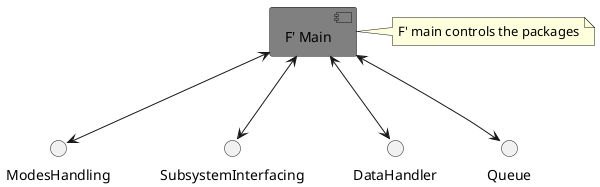
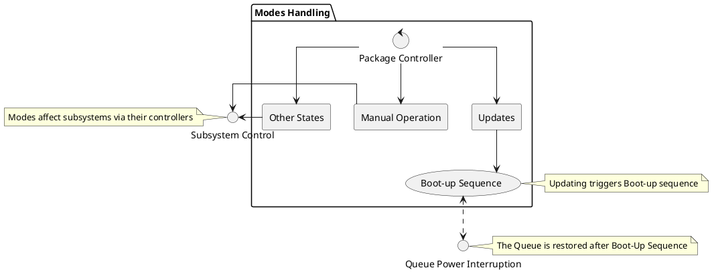
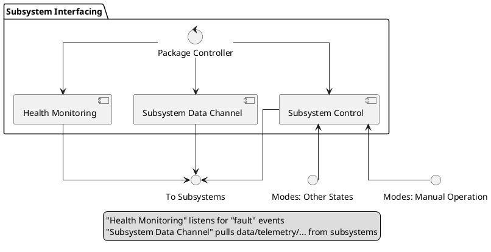
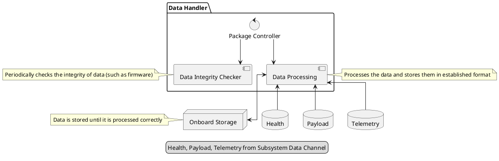
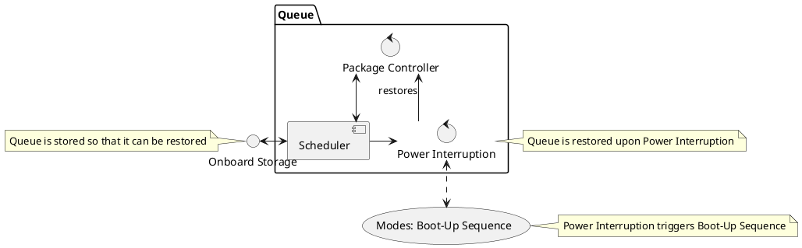
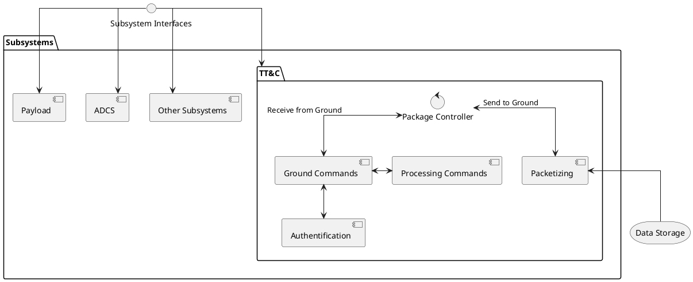
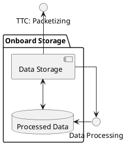

# CDH Modules Chart

## Overview

```plantuml
@startuml

' Parameters '
skinparam linetype ortho

/' Modes Handling Section '/
package "Modes Handling" as ModesHandling {
  ' === Modes Handling Definitions ===
  control "Package Controller" as ModesHandlingPackage
  ' btw: "usecase" makes it round
  usecase "Boot-up Sequence" as ModesBootUpSequence
  rectangle "Updates" as ModesUpdates
  rectangle "Other States" as ModesOtherStates
  rectangle "Manual Operation" as ModesManualOperation
  '=== Modes Handling Relationships ===
  ModesHandlingPackage --> ModesUpdates
  ModesHandlingPackage --> ModesOtherStates
  ModesHandlingPackage --> ModesManualOperation
  ModesUpdates --> ModesBootUpSequence
}
' === External ===
' Modes handling has these external links defined elsewhere:
/'
=== From Subsystem Interfacing ===
ModesOtherStates -down-> SubsystemControl
ModesManualOperation -down-> SubsystemControl
=== From Queue ===
QueuePowerInterruption ..> ModesBootUpSequence
'/

/' Subsystem Interfacing Section '/
package "Subsystem Interfacing" as SubsystemInterfacing {
  ' === Subsystem Interfacing Definitions ===
  control "Package Controller" as SubsystemInterfacingPackage
  component "Subsystem Control" as SubsystemControl
  component "Health Monitoring" as SubsystemHealth
  component "Subsystem Data Channel" as SubsystemData
  interface "To Subsystems" as SubsystemJunction
  ' === Subsystem Interfacing Relationships ===
  SubsystemInterfacingPackage --> SubsystemControl
  SubsystemInterfacingPackage --> SubsystemHealth
  SubsystemInterfacingPackage --> SubsystemData
}
  ' === External ===
  ModesOtherStates -down-> SubsystemControl
  ModesManualOperation -down-> SubsystemControl
  SubsystemJunction <-up- SubsystemData
  SubsystemJunction <-up- SubsystemHealth
  SubsystemJunction <-up- SubsystemControl

/' Data Handler Section '/
package "Data Handler" as DataHandler {
  ' === Data Handler Definitions ===
  control "Package Controller" as DataHandlerPackage
  component "Data Processing" as DataProcessing
  component "Data Integrity Checker" as DataIntegrity
  ' === Data Handler Relationships ===
  DataHandlerPackage -down-> DataProcessing
  DataHandlerPackage -down-> DataIntegrity
}
' === External ===
  node "Onboard Storage" as NodeOnboardStorage
  database "Health" as DataHealth
  database "Payload" as DataPayload
  database "Telemetry" as DataTelemetry
  DataProcessing <--> NodeOnboardStorage
  DataProcessing <-- DataHealth
  DataProcessing <-- DataPayload
  DataProcessing <-- DataTelemetry

/' Queue Section'/
package "Queue" as Queue {
  ' === Queue Definitions ===
  control "Package Controller" as QueuePackage
  component "Scheduler" as QueueScheduler
  control "Power Interruption" as QueuePowerInterruption
  ' === Queue Relationships ===
  QueuePackage <-> QueueScheduler
  QueueScheduler -> QueuePowerInterruption
  QueuePowerInterruption --> QueuePackage: restores
}
  ' === External ===
  interface "Onboard Storage" as QueueStorage
  QueueScheduler <-down-> QueueStorage
  QueuePowerInterruption <..> ModesBootUpSequence

/' Subsystems Section '/
' === Subsystems Definitions ===
package "Subsystems" as Subsystems {
component "Other Subsystems" as SubsystemsOther
component "ADCS" as SubsystemsADCS
component "Payload" as SubsystemPayload
  /' TT&C '/
  package "TT&C" as SubsystemTTC {
    ' === TT&C Definitions ===
    control "Package Controller" as SubsystemTTCPackage
    component "Packetizing" as TTCPacketizing
    component "Ground Commands" as TTCGroundCommands
    component "Authentification" as TTCAuthentification
    component "Processing Commands" as TTCProcessingCommands
    ' === TT&C Relationships ===
    SubsystemTTCPackage <-down-> TTCPacketizing: Send to Ground
    SubsystemTTCPackage <-down-> TTCGroundCommands: Receive from Ground
    TTCGroundCommands <-down-> TTCAuthentification
    TTCGroundCommands <-right-> TTCProcessingCommands
  }
}
  ' === External ===
  /'
  From Onboard Storage
  TTCPacketizing <-down- DataStorage
  '/
  ' === Subsystems Relationships ===
  SubsystemJunction -up-> SubsystemsOther
  SubsystemJunction -up-> SubsystemsADCS
  SubsystemJunction -up-> SubsystemPayload
  SubsystemJunction -up-> SubsystemTTC


/' Onboard Storage Section '/
package "Onboard Storage" as OnboardStorage{
  ' === Onboard Storage Definitions === '
  component "Data Storage" as DataStorage
  database "Processed Data" as DataProcessed
  ' === Onboard Storage Relationships === '
  DataStorage <-down-> DataProcessed
}
  ' === External ===
    TTCPacketizing <-down- DataStorage

' === Components Surrounding F' Main ===
component "F' Main" as Fmain #gray

' === Relationships Surrounding F' Main ===
Fmain <--> ModesHandling
Fmain <--> SubsystemInterfacing
Fmain <--> DataHandler
Fmain <--> Queue
@enduml
```

## F' Main

```plantuml
@startuml
' --F' MAIN EXPLANATION--

' === Components Surrounding F' Main ===
component "F' Main" as Fmain #gray

' === Relationships Surrounding F' Main ===
Fmain <--> ModesHandling
Fmain <--> SubsystemInterfacing
Fmain <--> DataHandler
Fmain <--> Queue

' === Explanation ===
note right of Fmain: F' main controls the packages
@enduml
```

## Modes Handler

```plantuml
@startuml
skinparam linetype ortho
' --MODES HANDLING EXPLANATION--

/' Modes Handling Section '/
package "Modes Handling" as ModesHandling {
  ' === Modes Handling Definitions ===
  control "Package Controller" as ModesHandlingPackage
  ' btw: "usecase" makes it round
  usecase "Boot-up Sequence" as ModesBootUpSequence
  rectangle "Updates" as ModesUpdates
  rectangle "Other States" as ModesOtherStates
  rectangle "Manual Operation" as ModesManualOperation
  '=== Modes Handling Relationships ===
  ModesHandlingPackage --> ModesUpdates
  ModesHandlingPackage --> ModesOtherStates
  ModesHandlingPackage --> ModesManualOperation
  ModesUpdates --> ModesBootUpSequence
}
' === External ===
interface "Subsystem Control" as SubsystemControl
interface "Queue Power Interruption" as QueuePowerInterruption
ModesOtherStates -left-> SubsystemControl
ModesManualOperation -left-> SubsystemControl
QueuePowerInterruption <.up.> ModesBootUpSequence

' === Explanation ===
note right of ModesBootUpSequence: Updating triggers Boot-up sequence
note left of SubsystemControl: Modes affect subsystems via their controllers
note right of QueuePowerInterruption: The Queue is restored after Boot-Up Sequence

@enduml
```

## Subsystem Interface

```plantuml
@startuml
skinparam linetype ortho
' --SUBSYSTEM INTERFACING EXPLANATION--

/' Subsystem Interfacing '/
package "Subsystem Interfacing" as SubsystemInterfacing {
  ' === Subsystem Interfacing Definitions ===
  control "Package Controller" as SubsystemInterfacingPackage
  component "Subsystem Control" as SubsystemControl
  component "Health Monitoring" as SubsystemHealth
  component "Subsystem Data Channel" as SubsystemData
  ' === Subsystem Interfacing Relationships ===
  SubsystemInterfacingPackage --> SubsystemControl
  SubsystemInterfacingPackage --> SubsystemHealth
  SubsystemInterfacingPackage --> SubsystemData
}
  ' === External ===
  interface "To Subsystems" as SubsystemJunction
  interface "Modes: Other States" as ModesOtherStates
  interface "Modes: Manual Operation" as ModesManualOperation
  ModesOtherStates -up-> SubsystemControl
  ModesManualOperation -up-> SubsystemControl
  SubsystemJunction <-up- SubsystemData
  SubsystemJunction <-up- SubsystemHealth
  SubsystemJunction <-up- SubsystemControl

' === Explanation ===
legend
  "Health Monitoring" listens for "fault" events
  "Subsystem Data Channel" pulls data/telemetry/... from subsystems
end legend
@enduml
```

## Data Handler

```plantuml
@startuml
skinparam linetype ortho
' --DATA HANDLING EXPLANATION--
package "Data Handler" as DataHandler {
  ' === Data Handler Definitions ===
  control "Package Controller" as DataHandlerPackage
  component "Data Processing" as DataProcessing
  component "Data Integrity Checker" as DataIntegrity
  ' === Data Handler Relationships ===
  DataHandlerPackage -down-> DataProcessing
  DataHandlerPackage -down-> DataIntegrity
}
' === External ===
  node "Onboard Storage" as NodeOnboardStorage
  database "Health" as DataHealth
  database "Payload" as DataPayload
  database "Telemetry" as DataTelemetry
  DataProcessing <--> NodeOnboardStorage
  DataProcessing <-- DataHealth
  DataProcessing <-- DataPayload
  DataProcessing <-- DataTelemetry

' === Explanation ===
note left of DataIntegrity: Periodically checks the integrity of data (such as firmware)
note right of DataProcessing: Processes the data and stores them in established format
note left of NodeOnboardStorage: Data is stored until it is processed correctly
legend
  Health, Payload, Telemetry from Subsystem Data Channel
endlegend
@enduml
```

## Queue

```plantuml
@startuml
skinparam linetype ortho
' --QUEUE EXPLANATION--
/' Queue Section'/
package "Queue" as Queue {
  ' === Queue Definitions ===
  control "Package Controller" as QueuePackage
  component "Scheduler" as QueueScheduler
  control "Power Interruption" as QueuePowerInterruption
  ' === Queue Relationships ===
  QueuePackage <-> QueueScheduler
  QueueScheduler -> QueuePowerInterruption
  QueuePowerInterruption --> QueuePackage: restores
}
  ' === External ===
  usecase "Modes: Boot-Up Sequence" as ModesBootUpSequence
  interface "Onboard Storage" as QueueStorage
  QueueScheduler <-left-> QueueStorage
  QueuePowerInterruption <..> ModesBootUpSequence

' === Explanation ===
note left of QueueStorage: Queue is stored so that it can be restored
note right of QueuePowerInterruption: Queue is restored upon Power Interruption
note right of ModesBootUpSequence: Power Interruption triggers Boot-Up Sequence
@enduml
```

## Subsystems

```plantuml
@startuml
skinparam linetype ortho
' --SUBSYSTEMS EXPLANATION--
/' Subsystems Section '/
' === Subsystems Definitions ===
package "Subsystems" as Subsystems {
component "Other Subsystems" as SubsystemsOther
component "ADCS" as SubsystemsADCS
component "Payload" as SubsystemPayload
  /' TT&C '/
  package "TT&C" as SubsystemTTC {
    ' === TT&C Definitions ===
    control "Package Controller" as SubsystemTTCPackage
    component "Packetizing" as TTCPacketizing
    component "Ground Commands" as TTCGroundCommands
    component "Authentification" as TTCAuthentification
    component "Processing Commands" as TTCProcessingCommands
    ' === TT&C Relationships ===
    SubsystemTTCPackage <-down-> TTCPacketizing: Send to Ground
    SubsystemTTCPackage <-down-> TTCGroundCommands: Receive from Ground
    TTCGroundCommands <-down-> TTCAuthentification
    TTCGroundCommands <-right-> TTCProcessingCommands
  }
}
  ' === External ===
  storage "Data Storage" as DataStorage
  TTCPacketizing <-down- DataStorage
  ' === Subsystems Relationships ===
  interface "Subsystem Interfaces" as SubsystemJunction
  SubsystemJunction -down-> SubsystemsOther
  SubsystemJunction -down-> SubsystemsADCS
  SubsystemJunction -down-> SubsystemPayload
  SubsystemJunction -down-> SubsystemTTC
@enduml
```

## Onboard Storage

```plantuml
@startuml
skinparam linetype ortho
' --ONBOARD STORAGE EXPLANATION--
package "Onboard Storage" as OnboardStorage{
  ' === Onboard Storage Definitions === '
  component "Data Storage" as DataStorage
  database "Processed Data" as DataProcessed
  ' === Onboard Storage Relationships === '
  DataStorage <-down-> DataProcessed
}
  ' === External ===
    interface "TTC: Packetizing" as TTCPacketizing
    interface "Data Processing" as DataProcessing
    DataStorage -right-> DataProcessing
    DataProcessing -left-> DataProcessed
    TTCPacketizing <-down- DataStorage
@enduml
```
