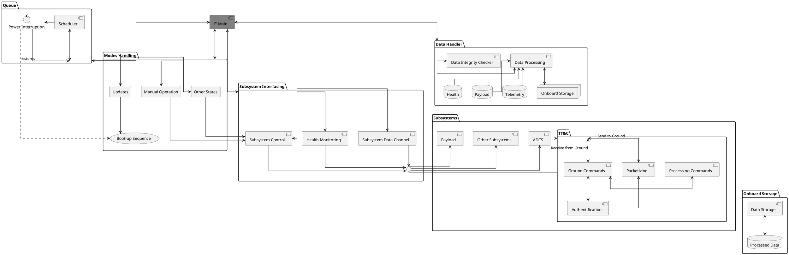

# CDH Modules Chart

```plantuml
@startuml

' Parameters '
skinparam linetype ortho

/' Modes Handling Section '/
package "Modes Handling" as ModesHandling {
  ' === Modes Handling Definitions ===
  ' btw: "usecase" makes it round
  usecase "Boot-up Sequence" as ModesBootUpSequence
  rectangle "Updates" as ModesUpdates
  rectangle "Other States" as ModesOtherStates
  rectangle "Manual Operation" as ModesManualOperation
  '=== Modes Handling Relationships ===
  ModesHandling --> ModesUpdates
  ModesUpdates --> ModesBootUpSequence
  ModesHandling --> ModesOtherStates
  ModesHandling --> ModesManualOperation
}

/' Subsystem Interfacing '/
package "Subsystem Interfacing" as SubsystemInterfacing {
  ' === Subsystem Interfacing Definitions ===
  component "Subsystem Control" as SubsystemControl
  component "Health Monitoring" as SubsystemHealth
  component "Subsystem Data Channel" as SubsystemData
  interface " " as SubsystemJunction
  ' === Subsystem Interfacing Relationships ===
  SubsystemInterfacing --> SubsystemControl
  SubsystemInterfacing --> SubsystemHealth
  SubsystemInterfacing --> SubsystemData
  SubsystemJunction <-up- SubsystemData
  SubsystemJunction <-up- SubsystemHealth
  SubsystemJunction <-up- SubsystemControl
  ' === From Modes Handling ===
  ModesOtherStates -down-> SubsystemControl
  ModesManualOperation -down-> SubsystemControl
}

/' Data Handler '/
package "Data Handler" as DataHandler {
  ' === Data Handler Definitions ===
  node "Onboard Storage" as NodeOnboardStorage
  component "Data Processing" as DataProcessing
  component "Data Integrity Checker" as DataIntegrity
  database "Health" as DataHealth
  database "Payload" as DataPayload
  database "Telemetry" as DataTelemetry
  ' === Data Handler Relationships ===
  DataProcessing <--> NodeOnboardStorage
  DataHandler -> DataProcessing
  DataHandler -> DataIntegrity
  DataProcessing <-down- DataHealth
  DataProcessing <-down- DataPayload
  DataProcessing <-down- DataTelemetry
}

/' Queue '/
package "Queue" as Queue {
  ' === Queue Definitions ===
  component "Scheduler" as QueueScheduler
  control "Power Interruption" as QueuePowerInterruption
  ' === Queue Relationships ===
  Queue <-> QueueScheduler
  QueueScheduler -> QueuePowerInterruption
  QueuePowerInterruption ..> ModesBootUpSequence
  QueuePowerInterruption --> Queue: restores
}

/' Subsystems '/
' === Subsystems Definitions ===
package "Subsystems" as Subsystems {
component "Other Subsystems" as SubsystemsOther
component "ADCS" as SubsystemsADCS
component "Payload" as SubsystemPayload
  /' TT&C '/
  package "TT&C" as SubsystemTTC {
    ' === TT&C Definitions ===
    component "Packetizing" as TTCPacketizing
    component "Ground Commands" as TTCGroundCommands
    component "Authentification" as TTCAuthentification
    component "Processing Commands" as TTCProcessingCommands
    ' === TT&C Relationships ===
    SubsystemTTC <-up-> TTCPacketizing: Send to Ground
    SubsystemTTC <-down-> TTCGroundCommands: Receive from Ground
    TTCGroundCommands <-down-> TTCAuthentification
    TTCGroundCommands <-right-> TTCProcessingCommands
  }
}
' === Subsystems Relationships ===
SubsystemJunction -up-> SubsystemsOther
SubsystemJunction -up-> SubsystemsADCS
SubsystemJunction -up-> SubsystemPayload
SubsystemJunction -up-> SubsystemTTC


/' Onboard Storage '/
package "Onboard Storage" as OnboardStorage{
  ' === Onboard Storage Definitions === '
  component "Data Storage" as DataStorage
  database "Processed Data" as DataProcessed
  ' === Onboard Storage Relationships === '
  DataStorage <-down-> DataProcessed
  TTCPacketizing <-down- DataStorage
}

' === Components Surrounding F' Main ===
component "F' Main" as Fmain #gray

' === Relationships Surrounding F' Main ===
Fmain <--> ModesHandling
Fmain <--> SubsystemInterfacing
Fmain <--> DataHandler
Fmain <--> Queue
@enduml
```
UML