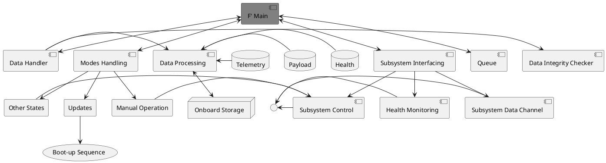

# CDH Modules Chart

```plantuml
@startuml

/' List of components
(use their alias set in `as ALIAS`)'/

' === Components Surrounding F' Main ===
component "F' Main" as Fmain #gray
component "Modes Handling" as ModesHandling
component "Data Handler" as DataHandler
component "Subsystem Interfacing" as SubsystemInterfacing
component Queue

' === Relationships Surrounding F' Main ===
Fmain <--> ModesHandling
Fmain <--> SubsystemInterfacing
Fmain <--> DataHandler
Fmain <--> Queue

/' Modes Handling Section '/
' === Modes Handling Definitions ===
' btw: "usecase" makes it round
usecase "Boot-up Sequence" as BootUpSequence
rectangle Updates
rectangle "Other States" as OtherStates
rectangle "Manual Operation" as ManualOperation
'=== Modes Handling Relationships ===
ModesHandling --> Updates
Updates --> BootUpSequence
ModesHandling --> OtherStates
ModesHandling --> ManualOperation

/' Subsystem Interfacing '/
' === Subsystem Interfacing Definitions ===
component "Subsystem Control" as SubsystemControl
component "Health Monitoring" as SubsystemHealth
component "Subsystem Data Channel" as SubsystemData
interface " " as SubsystemJunction
' === Subsystem Interfacing Relationships ===
SubsystemInterfacing --> SubsystemControl
SubsystemInterfacing --> SubsystemHealth
SubsystemInterfacing --> SubsystemData
SubsystemJunction <- SubsystemData
SubsystemJunction <- SubsystemHealth
SubsystemJunction <- SubsystemControl
' === From Modes Handling ===
OtherStates -> SubsystemControl
ManualOperation -> SubsystemControl

/' Data Handler '/
' === Data Handler Definitions ===
node "Onboard Storage" as OnboardStorage
component "Data Processing" as DataProcessing
component "Data Integrity Checker" as DataIntegrity
database "Health" as DataHealth
database "Payload" as DataPayload
database "Telemetry" as DataTelemetry
' === Data Handler Relationships ===
DataProcessing <-down-> OnboardStorage
DataHandler -> DataProcessing
DataHandler -> DataIntegrity
DataProcessing <- DataHealth
DataProcessing <- DataPayload
DataProcessing <- DataTelemetry

@enduml
```
