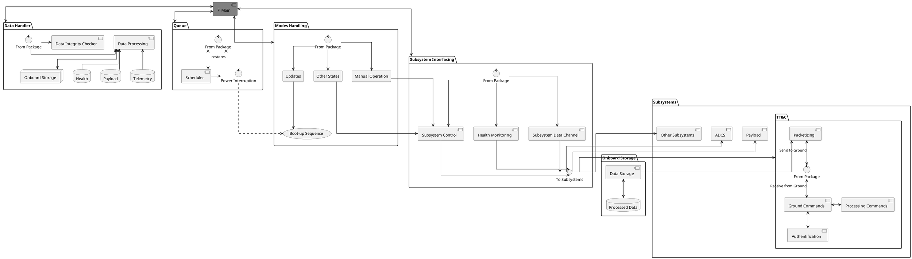

# CDH Modules Chart

```plantuml
@startuml

' Parameters '
skinparam linetype ortho

/' Modes Handling Section '/
package "Modes Handling" as ModesHandling {
  ' === Modes Handling Definitions ===
  control "From Package" as ModesHandlingPackage
  ' btw: "usecase" makes it round
  usecase "Boot-up Sequence" as ModesBootUpSequence
  rectangle "Updates" as ModesUpdates
  rectangle "Other States" as ModesOtherStates
  rectangle "Manual Operation" as ModesManualOperation
  '=== Modes Handling Relationships ===
  ModesHandlingPackage --> ModesUpdates
  ModesHandlingPackage --> ModesOtherStates
  ModesHandlingPackage --> ModesManualOperation
  ModesUpdates --> ModesBootUpSequence
}

/' Subsystem Interfacing '/
package "Subsystem Interfacing" as SubsystemInterfacing {
  ' === Subsystem Interfacing Definitions ===
  control "From Package" as SubsystemInterfacingPackage
  component "Subsystem Control" as SubsystemControl
  component "Health Monitoring" as SubsystemHealth
  component "Subsystem Data Channel" as SubsystemData
  interface "To Subsystems" as SubsystemJunction
  ' === Subsystem Interfacing Relationships ===
  SubsystemInterfacingPackage --> SubsystemControl
  SubsystemInterfacingPackage --> SubsystemHealth
  SubsystemInterfacingPackage --> SubsystemData
}
  ' === External ===
  ModesOtherStates -down-> SubsystemControl
  ModesManualOperation -down-> SubsystemControl
  SubsystemJunction <-up- SubsystemData
  SubsystemJunction <-up- SubsystemHealth
  SubsystemJunction <-up- SubsystemControl

/' Data Handler '/
package "Data Handler" as DataHandler {
  ' === Data Handler Definitions ===
  control "From Package" as DataHandlerPackage
  node "Onboard Storage" as NodeOnboardStorage
  component "Data Processing" as DataProcessing
  component "Data Integrity Checker" as DataIntegrity
  database "Health" as DataHealth
  database "Payload" as DataPayload
  database "Telemetry" as DataTelemetry
  ' === Data Handler Relationships ===
  DataProcessing <--> NodeOnboardStorage
  DataHandlerPackage -> DataProcessing
  DataHandlerPackage -> DataIntegrity
  DataProcessing <-down- DataHealth
  DataProcessing <-down- DataPayload
  DataProcessing <-down- DataTelemetry
}

/' Queue '/
package "Queue" as Queue {
  ' === Queue Definitions ===
  control "From Package" as QueuePackage
  component "Scheduler" as QueueScheduler
  control "Power Interruption" as QueuePowerInterruption
  ' === Queue Relationships ===
  QueuePackage <-> QueueScheduler
  QueueScheduler -> QueuePowerInterruption
  QueuePowerInterruption --> QueuePackage: restores
}
  ' === External ===
  QueuePowerInterruption ..> ModesBootUpSequence

/' Subsystems '/
' === Subsystems Definitions ===
package "Subsystems" as Subsystems {
component "Other Subsystems" as SubsystemsOther
component "ADCS" as SubsystemsADCS
component "Payload" as SubsystemPayload
  /' TT&C '/
  package "TT&C" as SubsystemTTC {
    ' === TT&C Definitions ===
    control "From Package" as SubsystemTTCPackage
    component "Packetizing" as TTCPacketizing
    component "Ground Commands" as TTCGroundCommands
    component "Authentification" as TTCAuthentification
    component "Processing Commands" as TTCProcessingCommands
    ' === TT&C Relationships ===
    SubsystemTTCPackage <-up-> TTCPacketizing: Send to Ground
    SubsystemTTCPackage <-down-> TTCGroundCommands: Receive from Ground
    TTCGroundCommands <-down-> TTCAuthentification
    TTCGroundCommands <-right-> TTCProcessingCommands
  }
}
  ' === Subsystems Relationships ===
  SubsystemJunction -up-> SubsystemsOther
  SubsystemJunction -up-> SubsystemsADCS
  SubsystemJunction -up-> SubsystemPayload
  SubsystemJunction -up-> SubsystemTTC


/' Onboard Storage '/
package "Onboard Storage" as OnboardStorage{
  ' === Onboard Storage Definitions === '
  component "Data Storage" as DataStorage
  database "Processed Data" as DataProcessed
  ' === Onboard Storage Relationships === '
  DataStorage <-down-> DataProcessed
}
  ' === External ===
    TTCPacketizing <-down- DataStorage

' === Components Surrounding F' Main ===
component "F' Main" as Fmain #gray

' === Relationships Surrounding F' Main ===
Fmain <--> ModesHandling
Fmain <--> SubsystemInterfacing
Fmain <--> DataHandler
Fmain <--> Queue
@enduml
```

UML
