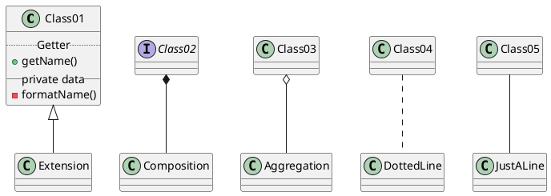

# PlantUML

The following is a quick guide on how to use Plant UML. If you wish to learn more about the syntax [click here](https://plantuml.com).

<!-- markdownlint-disable -->
<pre><code>```plantuml
@startuml

abstract class Class01
interface Class02

Class01 <|-- Extension
Class02 *-- Composition
Class03 o-- Aggregation
Class04 .. DottedLine
Class05 -- JustALine

class Class01 {
  .. Getter ..
  + getName()
  __ private data __
  - formatName()
}

@enduml
```</code></pre>

Becomes:

