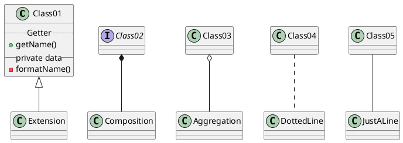

# How to contribute

See this [Git Guide](/raw-redirect/laurent-git-guide.md) to know how to use git.

## Set up

Clone the repo

`git clone https://github.com/sc-odin/docs.git`

Install Node.js (easiest way is through the [package](https://nodejs.org/en/)), then install docsify

`npm install -g docsify`

## Contributing

Make sure your master is up to date

```bash
git checkout master
git pull origin master
```

Create your own branch that will contain your modifications. For `<nameOfBranch>`, you might want to name it `issueNumberYouWantToFix-context` i.e. `47-fix-git-formatting`.

```bash
git checkout -b <nameOfBranch>
```

Perform your modifications and test your modifications using `docsify serve`

When you're happy with your changes, push them to your branch.

Add a good commit message i.e. `[#47] Fix Git page formatting`

```bash
git add <files modified>
git commit -m "[#issueNumber] Verb + context"
git push -u origin <nameOfBranch>
```

Make a [pull request](https://github.com/spaceconcordia/sc-odin-docs/pulls) and assign a collaborator.

## Using PlantUML

Learn PlantUML syntax [here](https://plantuml.com)

<!-- markdownlint-disable -->
<pre><code>```plantuml
@startuml

abstract class Class01
interface Class02

Class01 <|-- Extension
Class02 *-- Composition
Class03 o-- Aggregation
Class04 .. DottedLine
Class05 -- JustALine

class Class01 {
  .. Getter ..
  + getName()
  __ private data __
  - formatName()
}

@enduml
```</code></pre>

Becomes:


<!-- markdownlint-enable -->

## TBD

* Markdown guide

* Following the Website file structure
